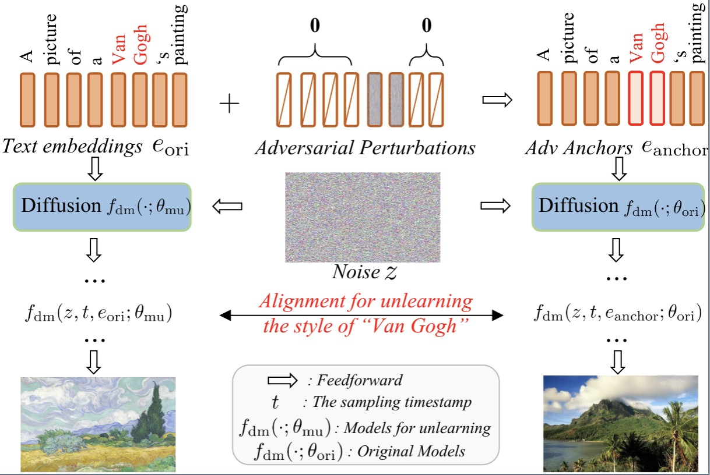

## [AdvAnchor: Enhancing Diffusion Model Unlearning with Adversarial Anchors]()
 
<div align='center'>

</div>

**The greatest truths are the simplest.

Issues: 
* analyze the impact of anchors on DM unlearning;
* the trade-off between the effectiveness of concept erasure and the preservation of model performance.

We
* systematically analyze the impact of anchors on DM unlearning;
* propose AdvAnchor, which includes two loss constraints and three optimization strategies to create adversarial anchors.

## Installation Guide

* To get started clone the following repository of Original Stable Diffusion [Link](https://github.com/CompVis/stable-diffusion)
* Then replace the files from our repository (ldm-replace.txt) to `stable-diffusion` main directory of stable diffusion. 
* Download the weights from [here](https://huggingface.co/CompVis/stable-diffusion-v-1-4-original/resolve/main/sd-v1-4-full-ema.ckpt) and move them to `stable-diffusion/models/ldm/`
* [Only for training] To convert your trained models to diffusers download the diffusers Unet config from [here](https://huggingface.co/CompVis/stable-diffusion-v1-4/blob/main/unet/config.json)

## Training Guide

After installation, follow these instructions to train a machine unlearning model:

1. Generate data and then put these samples to `./data/train/{0,1,2,3,4,5,6,7,8,9}` or `./data/eval/{0,1,2,3,4,5,6,7,8,9}`

* `python eval-scripts/generate-data.py --prompt 'Van Gogh' --model_name '0' --save_path './data/' --num_samples 1 --device 'cuda:0'`

`--prompt` should be `Van Gogh`, `Picasso`, `Cezanne`, `Jackson Pollock`, `Caravaggio`, `Keith Haring`, `Kelly McKernan`, `Tyler Edlin`, and `Kilian Eng` for style unlearning.

2. Train classification model 
* `python train-scripts/artist-cls-train.py --device 'cuda:0'`

3. Train comparative experiments: FMN, Abconcept, Esd
* `python train-scripts/FMN.py --erase_cat 'style' --erased_index 0 --lr 1e-5 --iter_break 50 --devices '0,1'`
* `python train-scripts/Abconcept.py --erase_cat 'style' --erased_index 0 --lr 1e-5 --iter_break 75 --devices '0,1'`
* `python train-scripts/Esd.py --iter_break 1000 --train_method 'xattn' --erase_cat 'style' --erased_index 0 --devices '0,1'`

## AdvAnchor
`erased_index` selects the erased style using , `lr` and `iter_break` are the learning rate and the maximum iteration step for unlearning, respectively. `lr2` and `w_iter_break` are the learning rate and the maximum iteration step for creating anchors, respectively. (Any question please contact me).
* `python train-scripts/Ladv1ablation_op1.py --erase_cat 'style' --erased_index 0 --lr 1e-5 --lr2 1e-4 --iter_break 50 --w_iter_break 30 --att_size 0 --ori_flag --devices '0,1'`

Try other variants `Ladv1ablation_op2.py`,`Ladv1ablation_op3.py`,`Ladv2ablation_op1.py`,`Ladv2ablation_op2.py`,`Ladv2ablation_op3.py`.

## Generate Evaluation Images

To generate images from one of the custom models use the following instructions:

* To use `eval-scripts/generate-images.py` you would need a csv file with columns `prompt`, `evaluation_seed` and `case_number`. (Sample data in `data/`) 
* `python eval-scripts/generate-images.py --model_name='' --prompts_path './data/NSFW_NudeClasses_50.csv' --save_path './output/' --num_samples 5 --device 'cuda:0'`

## Evaluations


For styles and objects, rename the dir_name of generated images to `eval`
* `python train-scripts/move_image.py`
* Classify object categories:
* `python eval-scripts/cate-cls-test.py` 
* Classify style categories:
* `python eval-scripts/artist-cls-test.py`

For exposed content, rename the dir_name of generated images to `eval2`
* `python train-scripts2/nudity_move_image.py`
* Classify nudity categories:
* `python eval-scripts/nudenet-classes.py --folder ./evaluation_folder-diff/eval/`

Calculate FID and LPIPS metric values. `erase_index` represents the index of the erased category, (or not using with `erase_index` = -1).
* `python eval-scripts/FID_eval.py --path1 './output/ori' --path2 './output/eval'` --erase_index 0
* `python eval-scripts/lpips_eval.py --path1 './output/ori' --path2 './output/eval'` --erase_index 0


## Citing our work
If you find our work valuable, please consider citing the preprint using the following format:
```
```
